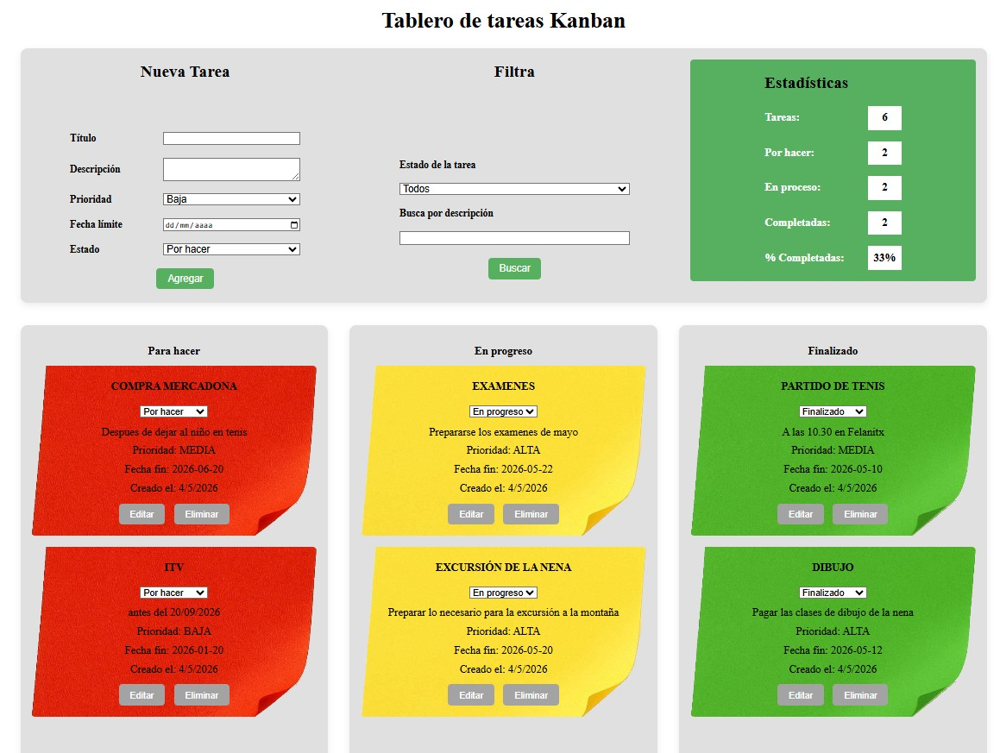

# Tablero de tareas kanban

## [Acceder a la web] (https://cesarifc33.github.io/kanban/)
## [Repositrorio Git] (https://github.com/cesarIfc33/kanban)

**Descripción:** Consta de una página web funcional, que sirve de ayuda para gestionar las tareas personales, de una empresa o proyectos.

**Permite:**
* Crear tareas con fecha de finalización
* Organizarlas por estados
* Obtener un esquema de situación

## Estructura
    app-kanban
    ├── css
    │   └── style.css
    ├── img
    │   ├── favicon.png
    │   ├── img-background-green-v2.png
    │   ├── img-background-red-v2.png
    │   └── img-background-yellow-v2.png
    ├── index.html
    ├── js
    │   ├── kanban.js
    │   ├── script.js
    │   ├── storage.js
    │   └── ui.js
    └── README.md

## Guía de uso
Aplicación web basada en gestión de tareas en tres estados
* Tarea por hacer
* Tarea en proceso
* Tarea finalizada

Contiene un formulario para dar de alta una tarea con los datos necesarios:
* Titulo
* Descripción
* Fecha de finalización
* Fecha de creación
* Prioridad

Ademas contiene un buscador de tareas que facilita poder encontrar entre tantas las deseadas.

Incluso dispone de un menú de estadisticas con el resumen de la situación.

Permite, ademá de crear, se pueden editar y eliminar

## Imagen de la aplicación

